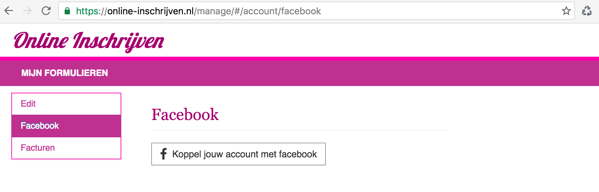
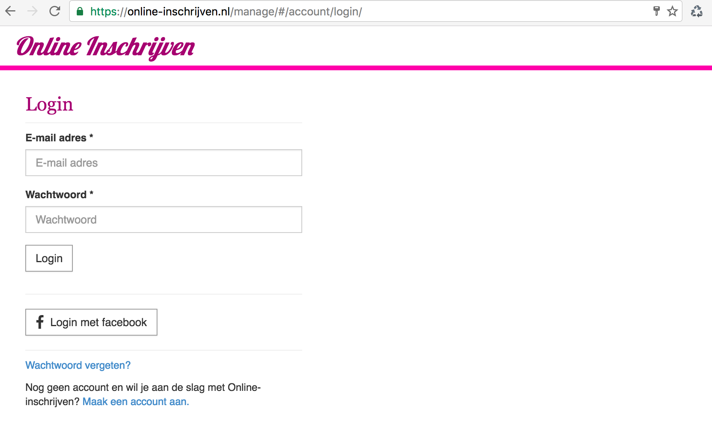

##Account instelingen: Facebook account koppelen

Het is handig om jouw account bij Online-inschrijven te koppelen met facebook zodat je altijd makkelijk kunt inloggen.

- Wanneer je bent ingelogd in Online-inschrijven klik op je naam rechtsboven. Kies uit het menu 'Mijn account'
- Kies links de menu optie 'Facebook'
- Wanneer je account nog niet gekoppeld is kun je dit doen door op 'Koppel jouw account met facebook' te klikken.

Log eventueel in op facebook in het zojuist geopende venster. Wanneer je op jouw device al bent ingelogd op facebook gaat dit process automatisch.


Online-inschrijven vraagt alleen om je basis gegevens, jouw naam, account id en  e-mail adres
die nodig zijn het inloggen op Online-inschrijven, en zal nooit jouw vrienden ophalen of iets posten.


Jouw account is nu gekoppeld met facebook.

![iFacebook koppelen] succes](img/facebook1-2.png)


Voila, Je kunt de volgende keer met facebook inloggen door op 'Login met facebook' te klikken.



Wanneer je de facebook koppeling wilt verwijderen kun je dit altijd doen door in jouw account instellingen op de knop 'Facebook koppeling verwijderen' te klikken.

