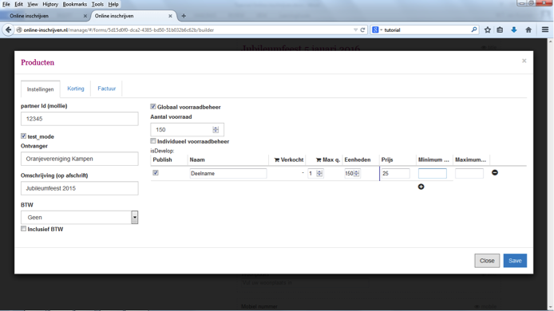

##Stap 10: Compleet maken en volgorde bepalen
Door op een vraag te klikken, krijg je weer toegang tot de achterliggende tekst. Je kunt deze dus ook telkens aanpassen. Als een veld toch niet voldoet aan je wensen, dan kun je het verwijderen door op het prullenmand-icoontje te klikken. Met het plusje onder de vraag erboven kom je terug in het keuzemenu.

-	Met de veldsoort ‘image’ kun je een logo of foto in je formulier opnemen. 
-	Om de volgorde van de vragen te veranderen houd je de vraag aangeklikt, terwijl je naar boven of beneden scrolt. Als je denkt dat het formulier compleet is, dan klik je op ‘bewaar’ onderaan het formulier.
-	Met ‘file upload’ kun je een document aan je formulier hangen, bijvoorbeeld een programma van je evenement. Online-inschrijven ondersteunt de meeste gangbare documentsoorten als word, PowerPoint en pdf.
-	Als je veel instructie hebt of andere tekst, dan kun je kiezen voor ‘text box groot’. We adviseren echter terughoudend te zijn met tekst in een formulier.
-	‘Weergave html’ geeft de mogelijkheid om html te gebruiken en teksten anders te lijnen of vet/cursief weer te geven. 
-	‘Weergave titel’ is bedoeld om titels te maken voor het formulier. Dit veld staat standaard in elk formulier.
-	Met de optie ‘Ideal/Mollie’ kun je het formulier aan je Mollie account koppelen en betalingen laten verrichten. Deze veldsoort moet apart gepubliceerd worden. 
--	Vul bij ‘product instellingen’ je partner ID, contactgegevens en BTW in (links) en 
--	stel prijs en voorraad in (rechts). Minimum en maximum prijs kan gebruikt worden, bijvoorbeeld bij donaties.
--	‘Globaal voorraadbeheer’ is voor gevallen waarin één product wordt aangeboden voor één prijs. ‘Individueel voorraadbeheer’ gebruik je als je verschillende producten en prijzen hanteert. Vergeet niet de instellingen te saven. Klik ‘test mode’ aan om de betaalmodule straks te kunnen testen zonder te betalen.
--	Bij het tabblad korting kun je eventuele kortingen instellen
--	Bij factuur kun je ervoor kiezen om automatisch een factuur per email te verzenden

