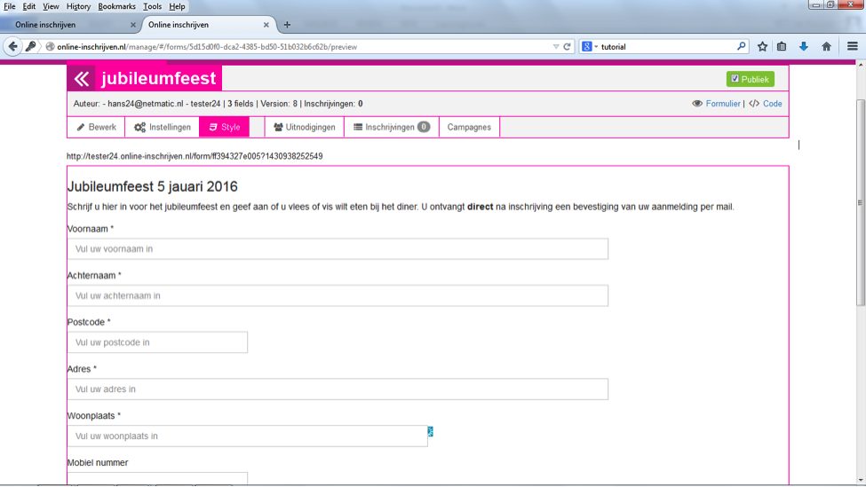

##Stap 11: Het resultaat bekijken
Als je denkt dat je formulier compleet is, dan is het tijd om het te gaan bekijken zoals de inschrijver het straks ziet. Klik hiervoor op ‘(oog) formulier’. Zet het formulier op ‘publiek’ (rechtsboven) en kies de optie ‘style’ om je formulier verder vorm te geven. We adviseren om in deze fase een testinschrijving te doen, zodat eventuele fouten of onduidelijkheden aan het licht komen.

