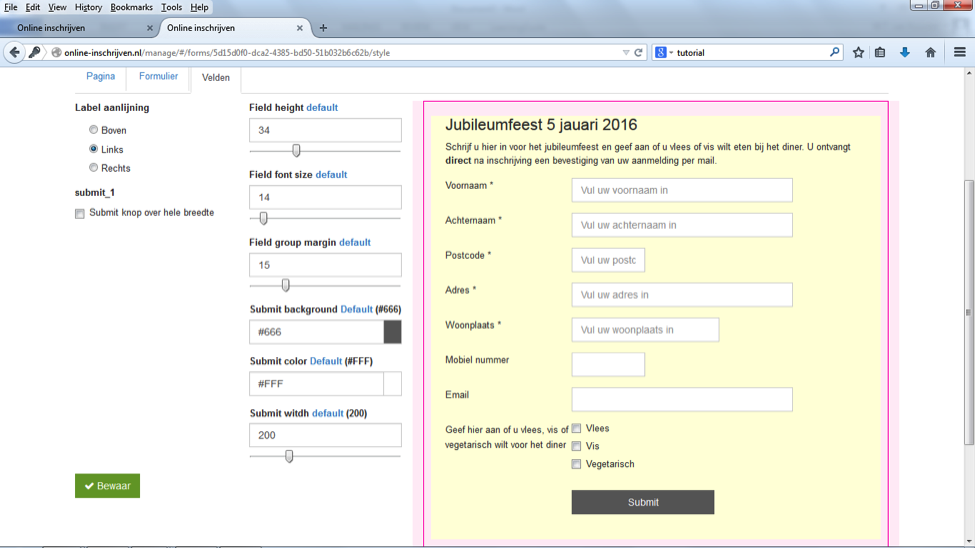

##Stap 12: Formulier vormgeven
Je kunt hier de pagina, het formulier of specifieke velden vormgeven:

-	Pagina: achtergrondkleur instellen en ‘powered by’ verwijderen (wij vinden het leuk als je dat niet doet)
-	Formulier: marges onder, boven, links en rechts in de kolom uiterst links. Achtergrondkleur, tekstkleur, lettertype en –grootte en het formaat van de kaderlijnen.
-	Velden: met label aanlijning bepaal je of je de vragen naast of boven de invulvelden wilt hebben (kolommen uiterst links), hoe groot de velden zijn en hoe de submitknop eruit ziet. 

We adviseren om na vormgeven het formulier nogmaals te testen om te zien of alle velden optimaal in te vullen zijn.

