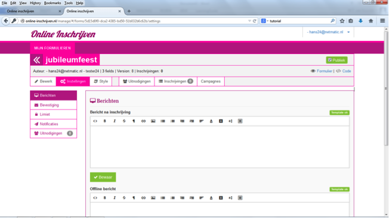

##Stap 13: Inschrijvingsproces bepalen
Met de keuze ‘instellingen’ bepaal je wat er gebeurt na inschrijving. 

-	In ‘berichten’ kun je de tekst bepalen die de inschrijver direct na inschrijving op zijn/haar scherm ziet. Vaak iets als: ‘Uw inschrijving is compleet, u ontvangt een email in uw inbox.’
-	In ‘offline bericht’ geef je de tekst die de inschrijver ziet wanneer het formulier om wat voor reden dan ook, offline is. Vaak iets als: ‘het is op dit moment niet mogelijk om in te schrijven, stuur een email naar info@jubileumorganisatie.nl’

Bij ‘bevestiging’ (klik ‘verzend email’ en kies bewaar, waarna het html veld zich opent) kun je het mailbericht opstellen dat hij/zij in zijn mailbox krijgt na inschrijving. In deze email kun je meer informatie geven over het evenement en het verloop van de communicatie. Uitleg van velden:

-	‘Aan’ is meestal ‘email’. Het systeem stuurt de bevestiging naar het emailadres dat de inschrijver heeft opgegeven.
-	Van email en naam: hier worden emailadres en naam vermeld van de afzender. Als u dit zelf bent, dan kunt u kiezen voor de opties ‘use my email address’ en ‘use my name’
-	De mailbox waar een ‘reply’ van de ontvanger naartoe wordt geleid kan worden ingevuld onder ‘reply to email’. Jouw mailadres?
-	Onderwerp: hier geef je de tekst die in het onderwerp komt. In veel gevallen zal dit iets als ‘bevestiging inschrijving jubileumfeest’ zijn.
-	Tekstveld bevat html, en kan dus vormgegeven worden. Via het icoontje uiterst rechts kan je ook formuliervelden in de mail opnemen. 

Onder ‘limiet’ kun je het maximale aantal inschrijvers instellen. Onder ‘notificaties’ kun je de emailadressen vermelden van de mensen die een bericht moeten krijgen van elke nieuwe inschrijving (jijzelf bijvoorbeeld). 

Vergeet niet om alle instellingen op te slaan met ‘bewaren’ en nogmaals een testinschrijving te doen. 
