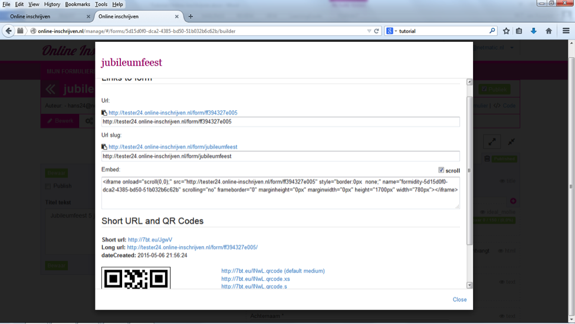

##Stap 14: Uitnodigen
Nu het hele formulier is ingesteld en vormgegeven, kun je mensen gaan uitnodigen om in te schrijven. Er zijn verschillende mogelijkheden om het formulier onder de aandacht van je publiek te brengen, in alle gevallen maak je gebruik van de optie ‘code’ rechts bovenaan het formulier:
-	Link naar het formulier verzenden per email; kopieer de url (deze blijft altijd uniek) of de url slug (deze is herkenbaar en gemakkelijker te onthouden) en plak deze in je email.
-	Gebruik de link naar de QR code, die door de inschrijver gescand kan worden om naar het formulier te gaan. Of print de QR code, zodat de ontvanger deze kan scannen.
-	Embed het formulier in je website door de ‘Embed’ tekst in je website op te nemen.

