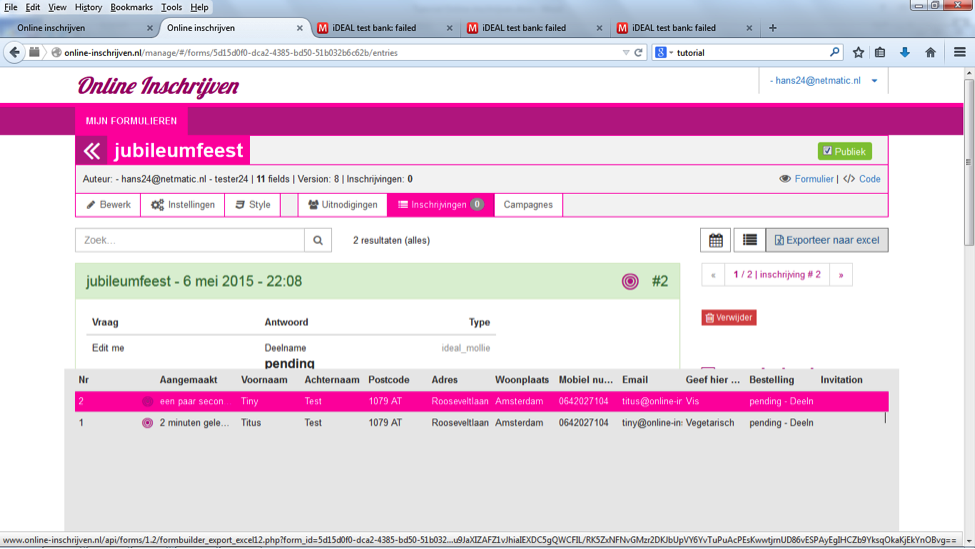

##Stap 15: Inschrijvingen bekijken en exporteren
Onder ‘inschrijvingen’ zie je hoeveel inschrijvingen er zijn binnengekomen. (Onder ‘instellingen’ en ‘notificaties’ kun je instellen dat je een notificatie krijgt van elke inschrijving.) Als je op ‘inschrijvingen’ klikt, krijg je een overzicht van alle gegevens van de inschrijvers. In deze fase zie je hier je testinschrijvingen terug. Als straks de betaalmodule uit de testmodus is en de echte betalingen binnenkomen, dan zal bij elke succesvolle betaling in groen ‘payed’ komen te staan. Als een betaling is mislukt, bijvoorbeeld omdat de inschrijver zijn gegevens niet bij zich had, dan staat er in rood ‘pending’. 

Je kunt te allen tijde een overzicht maken van alle inschrijvingen en ontvangen betalingen met de knop ‘Exporteer naar Excel’. In het Excelsheet kun je de kolommen die je niet nodig hebt verwijderen, bijvoorbeeld om een mooi deelnemersoverzicht te maken.

