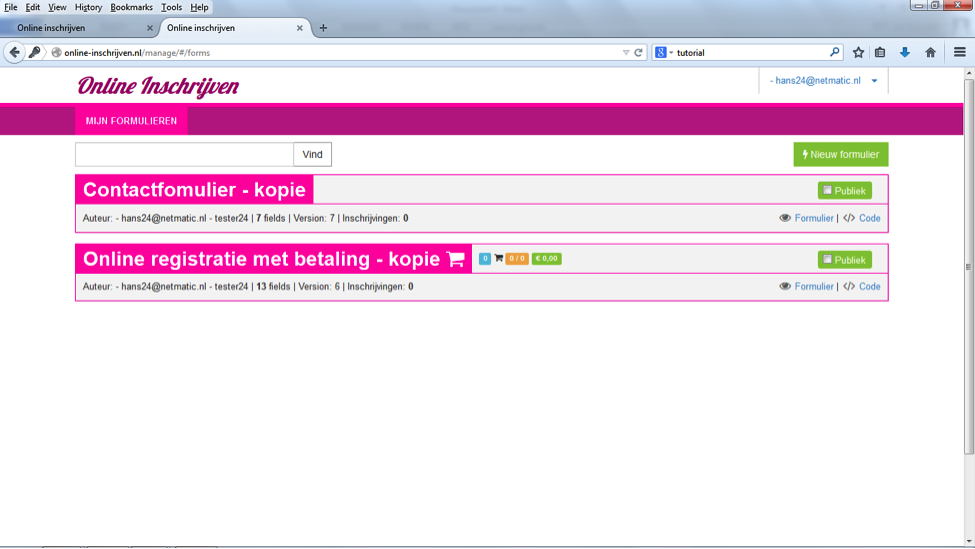

##Stap 2: formulierenoverzicht en formulier aanmaken
Als je bent ingelogd, kom je in ‘Mijn formulieren’. Door (een deel van) de formuliernaam in het ‘vind’ balkje te typen kun je het juiste formulier zoeken. Met ‘nieuw formulier’ maak je een nieuw formulier aan.

