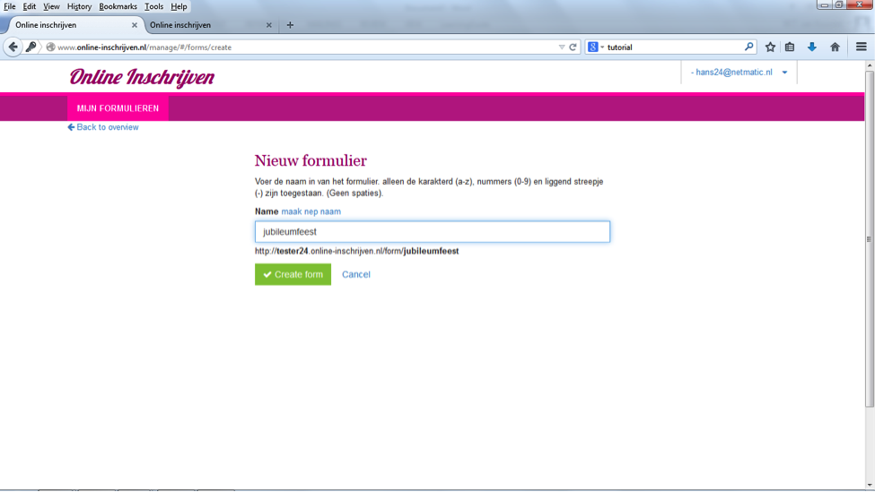

##Stap 3: Formuliertitel
Geef je formulier een duidelijke naam, bijvoorbeeld de naam van het evenement dat je organiseert, en klik ‘create form’. Onder de tekstbox kun je zien hoe het webadres van het formulier er straks uit gaat zien. Kies voor ‘maak nepnaam’ om een fake titel te genereren. Deze titel kun je later wijzigen via de functie ‘hernoem formulier’.

