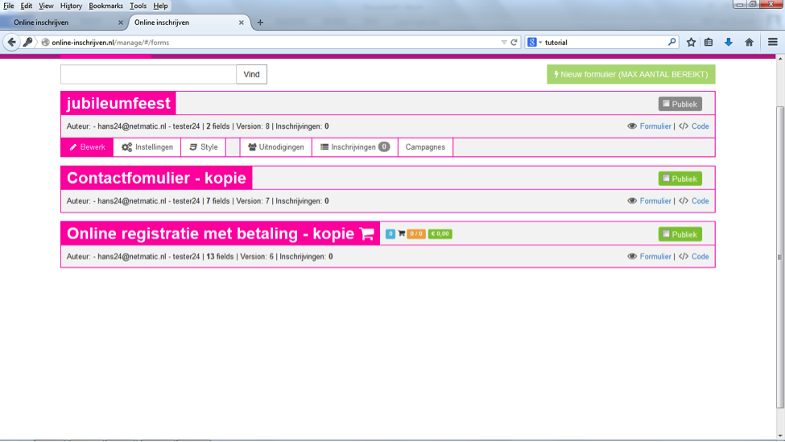
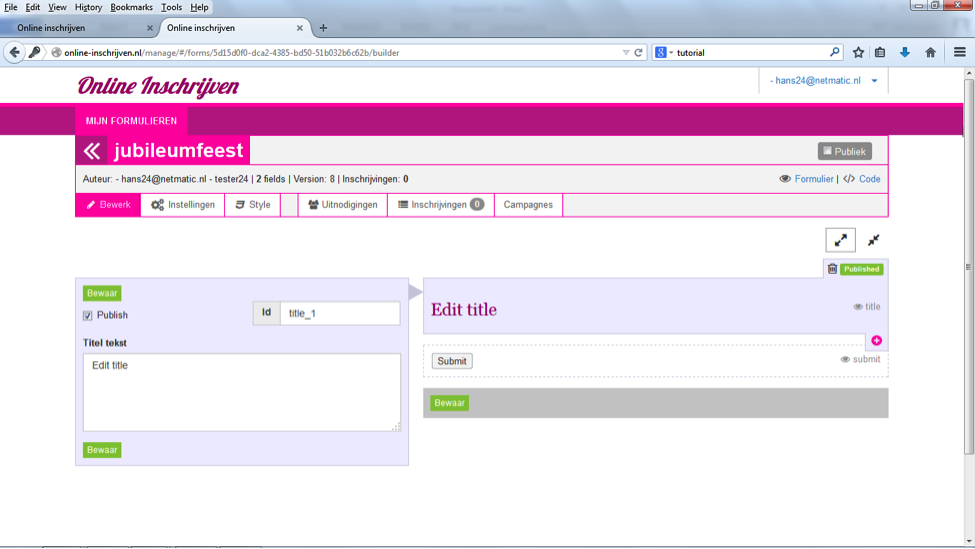

##Stap 4: Het formulier opzetten en bewerken
Kies ‘bewerken’ om het formulier op te zetten. Het formulier is nog niet gepubliceerd, omdat de optie ‘publiek’ nog niet is aangevinkt. Binnen ‘bewerken’ zijn vele opties mogelijk, die we hierna bespreken.

Van het formulier zijn alleen het titelveld en de ‘submit’ knop standaard ingesteld. De rest kun je naar eigen inzicht toevoegen.

