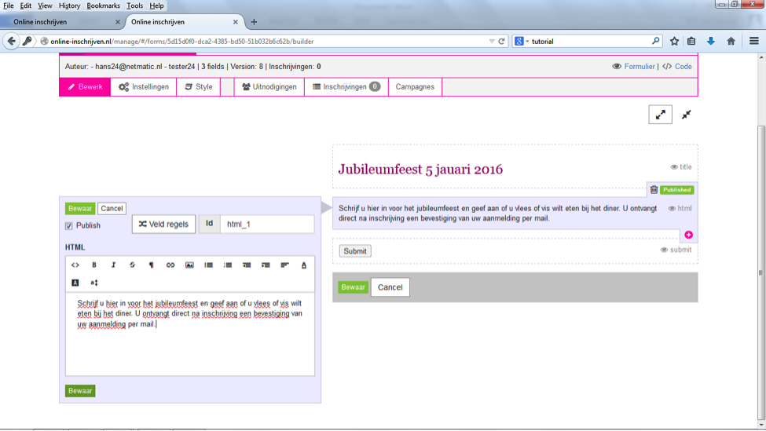

##Stap 7: Inleidende tekst
Om de inschrijver goed door het inschrijvingsproces te helpen, is het verstandig een korte uitleg te geven. Hiervoor kun je gebruik maken van de veldsoort ‘Paragraph text’. Met deze optie kun je ook html gebruiken en is het bijvoorbeeld mogelijk om tekstdelen te laten opvallen door ze vet of cursief te maken. Klik ‘bewaar’ om de inleidende tekst te bewaren.

