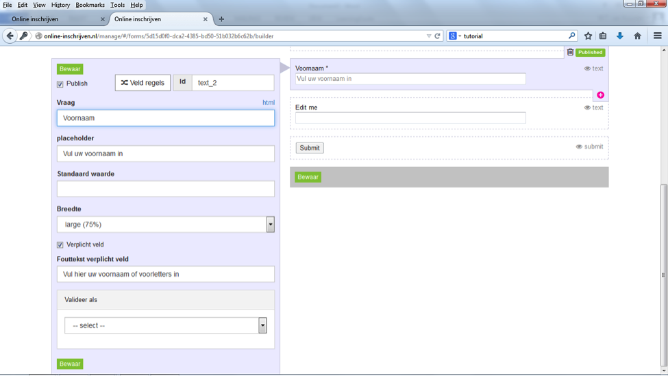

##Stap 8: Contactgegevens
Klik opnieuw op het ‘plusje’ en kies ‘text box’ om velden voor contactgegevens (naam, adres, postcode, woonplaats) aan te maken. 

Met de Placeholder kun je instructies geven in het invulveld, die de inschrijver helpen de juiste gegevens in te vullen.
 
Met fouttekst kun je de inschrijver helpen als hij/zij niet de gewenste informatie heeft ingevuld.

We adviseren om contactgegevens altijd verplicht te maken. Wanneer sprake is van een vaste tekst, dan kun je het de inschrijver gemakkelijk maken door deze tekst alvast in te vullen met de optie ‘standaard waarde’. Als het antwoord een bepaalde vorm moet hebben (bijvoorbeeld alleen numeriek of een emailadres), dan kun je die restrictie ingeven bij ‘Validatie’.
Desgewenst kun je voor kleine velden (bijvoorbeeld postcode) de breedte van de tekst box aanpassen.

Voor emailadres, webadres en telefoonnummer kun je gebruikmaken van de desbetreffende veldsoorten onder ‘tools’ in het veldsoortenoverzicht.

Deze velden zijn al goed ingesteld. Klik op ‘Bewaar’ om elke text box op te slaan.

