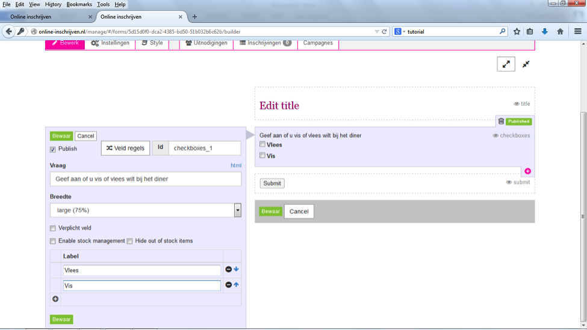

##Stap 9: Keuzevragen
Als de inschrijver een keuze dient te maken uit verschillende opties, dan kun je hiervoor drie veldtypes gebruiken: 

- ‘options’ (rond, zogenaamde radio buttons), 1 keuze mogelijk.
- ‘Drop down’ (uitvouwbaar). 1 keuze mogelijk.
- ‘check boxes’ (vierkant). Meerde keuzes mogelijk.

Aan de linkerzijde vul je de vraag in (vraag) en de mogelijkheden waaruit de inschrijver kan kiezen onder label (option 1, option 2, met het plusje kun je de keuze uitbreiden). We adviseren om de optie ‘verplicht veld’ aan te klikken. Als van een optie een beperkte voorraad is, kies dan ‘enable stock management’ en geef het aantal in. Met ‘hide out of stock items’ wordt de optie verborgen zodra het maximum aantal is bereikt. Klik op ‘bewaar’ om de vraag op te slaan. 

